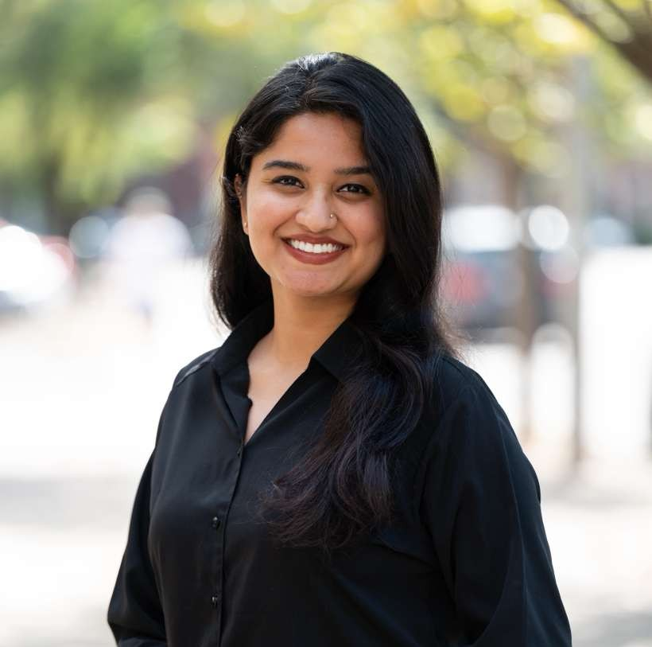

::: {.callout-tip appearance="minimal"}
*We are extraordinarily fortunate to be joined by an incredibly talented group of trainees and staff members!*
:::

## PhD Students

<!-- ::: {.g-col-12 .g-col-md-3}
{width=200}
::: -->

::: {.g-col-12 .g-col-md-9}
**Xuebo Wang**

Xuebo is a 1st year PhD student in the Biostatistics and Bioinformatics program. Xuebo is co-mentored by Dr. Chang Su (Emory, BIOS).

<!-- -- [](mailto:student@emory.edu) -->
:::

::: {.g-col-12 .g-col-md-9}
**Yikai Dong**

Yikai is a 1st year Genetics and Molecular Biology PhD student currently rotating in the lab.
:::

## Research Staff

::: {.g-col-12 .g-col-md-3}
{width=200}
:::

::: {.g-col-12 .g-col-md-9}
**Prarthana Sanjeeva Reddy**

Prarthana Sanjeeva Reddy is a Lead Research Specialist at Emory School of Medicine working with Dr. Joshua Weinstock, where she conducts genome-wide association studies focused on clonal hematopoiesis. She holds an M.S. in Bioinformatics from Georgia Institute of Technology and has prior research experience at Yale School of Public Health, and industry settings in protein science and therapeutic design. Her work focuses on large-scale whole-genome sequencing and genome-wide association studies to understand the genetic basis of clonal hematopoiesis and germline determinants of clonal expansion. 
 
:::

## Alumni

### Past Lab Members

- **Mingke Tian** (2024-2025), Emory Undergraduate
- **Amber Zhou** (2024-2025), Emory Undergraduate
